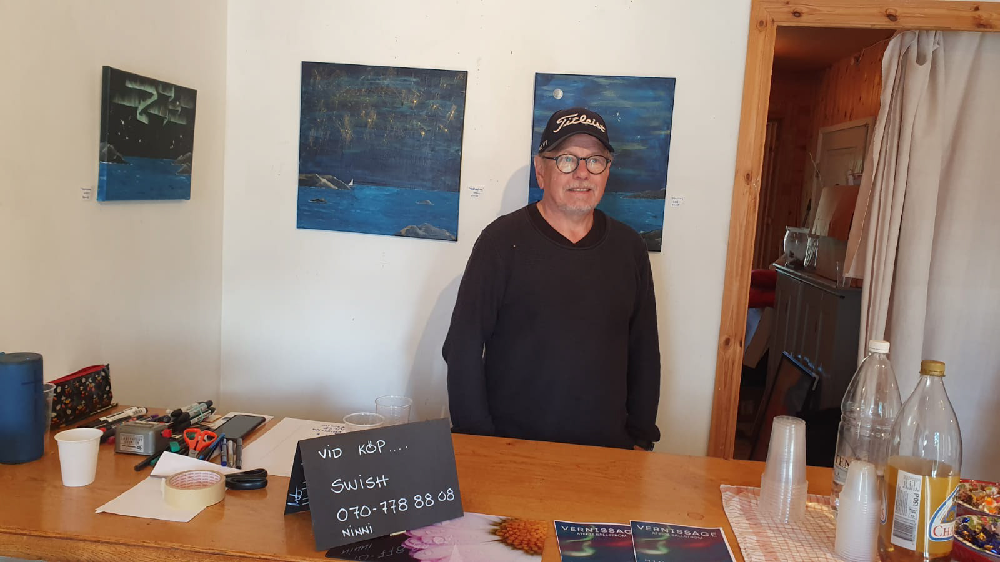
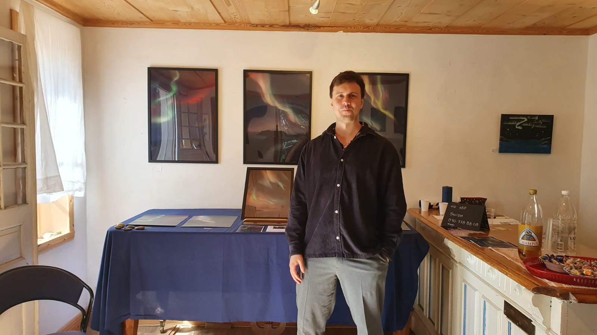
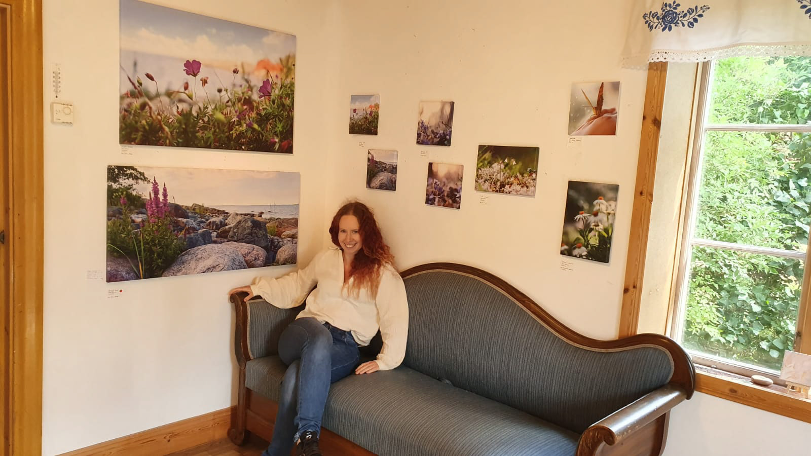

# Ateljé Sällström — Website

A modern, responsive website for **Ateljé Sällström**, a Swedish family art collective consisting of three artists: Lennart Sällström (father), Robin Sällström (son), and Ninni Sällström (daughter).

## Pages

| Page | File | Description |
|------|------|-------------|
| Hem (Home) | `index.html` | Hero section, introduction, artist previews, featured works |
| Galleri (Gallery) | `galleri.html` | Filterable masonry grid with lightbox viewer |
| Om oss (About) | `om-oss.html` | Individual artist profiles with bios and exhibition history |
| Kontakt (Contact) | `kontakt.html` | Contact form and social media links |

## Tech Stack

- Pure HTML5, CSS3, and vanilla JavaScript (no build step required)
- Google Fonts (Cormorant Garamond + DM Sans)
- Lucide Icons (CDN)
- Placeholder images from Unsplash

## Project Structure

```
atelje-sallstrom/
├── index.html          # Home page
├── galleri.html        # Gallery page
├── om-oss.html         # About page
├── kontakt.html        # Contact page
├── css/
│   └── style.css       # All styles
├── js/
│   ├── main.js         # Navigation, gallery, lightbox, animations
│   └── fireflies.js    # Firefly particle background animation
├── images/             # Place your own artwork images here
├── netlify.toml        # Netlify deployment config
└── README.md
```

## Replacing Placeholder Images

The site currently uses placeholder images from Unsplash. To replace them with real artwork:

### Step 1 — Prepare an `/images/` folder

Create an `images/` directory in the project root (if it doesn't already exist) and organize your files:

```
images/
├── hero.jpg              # Hero background (optional, currently uses gradient)
├── studio.jpg            # Studio photo for the About page intro
├── lennart-portrait.jpg  # Lennart's profile photo
├── robin-portrait.jpg    # Robin's profile photo
├── ninni-portrait.jpg    # Ninni's profile photo
├── gallery/
│   ├── lennart-01.jpg    # Gallery artwork images
│   ├── lennart-02.jpg
│   ├── robin-01.jpg
│   ├── robin-02.jpg
│   ├── ninni-01.jpg
│   ├── ninni-02.jpg
│   └── ...
└── featured/
    ├── featured-01.jpg   # Featured works on the home page
    ├── featured-02.jpg
    └── ...
```

### Step 2 — Update image `src` attributes in the HTML

In each HTML file, find the `` tags and replace the Unsplash URLs with local paths. For example:

**Before:**
```html

```

**After:**
```html

```

### Step 3 — Portrait photos

Update the portrait image URLs in `om-oss.html` and `index.html` (artist cards section):

```html
<!-- In om-oss.html and index.html, find each artist's portrait img tag -->



```

### Image Tips

- Use **JPEG** for photographs and paintings (good compression, wide support)
- Aim for **800–1200px** width for gallery images (balances quality and load time)
- Portrait photos work best at roughly **square or 3:4** aspect ratio
- Gallery images with `gallery-item--tall` class look best at **2:3** portrait ratio
- Gallery images with `gallery-item--wide` class look best at **3:2** landscape ratio

## Deployment

### Netlify (recommended)

1. Connect this GitHub repo to [Netlify](https://app.netlify.com)
2. Set the **publish directory** to `/` (root)
3. Every push to `main` will auto-deploy

Alternatively, drag and drop the project folder to [Netlify Drop](https://app.netlify.com/drop).

### Other Static Hosts

Upload all files maintaining the directory structure. No build step is needed — the site is pure HTML/CSS/JS.

## Color Palette

| Color | Hex | Usage |
|-------|-----|-------|
| Cyan | `#9BE1E5` | Gradient accent, hover effects |
| Deep Teal | `#2AADC1` | Primary accent, buttons, links |
| Hot Pink | `#F491C5` | Gradient accent |
| Vivid Purple | `#D269DA` | Gradient accent |
| Background | `#FAF9F7` | Warm near-white base |

## License

All content and artwork references belong to Ateljé Sällström. Placeholder images are from [Unsplash](https://unsplash.com) and should be replaced with actual artwork.
